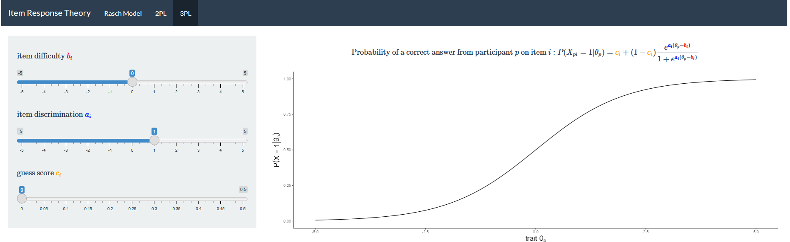

# IRT-shiny-webapp

A small web-app that visualizes how parameter changes affect the probability density functions of different IRT-models.

The implemented models are:
1. Rasch model
2. Two Parameter Logistic model
3. Three Parameter Logistic model

Example Screenshot:
